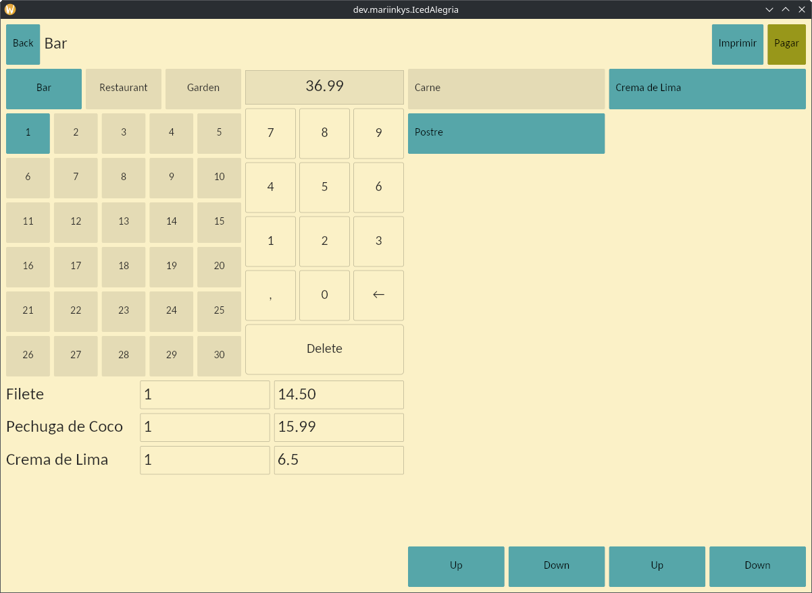
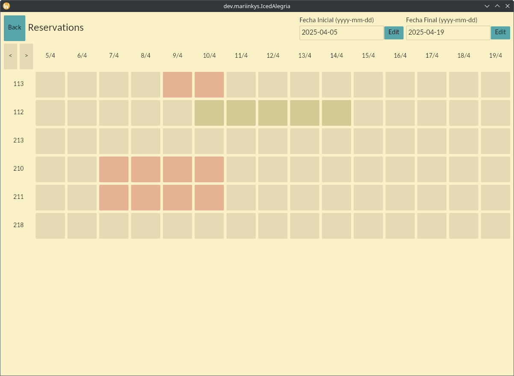

<div align="center">
  <br>
  
  <h1>Alegría</h1>

  
  


  <h3>Software básico TPV Hostelería</h3>
  <h3>Basic POS Software for an Hotel/Restaurant</h3>

  
  

</div>

## Notes

This software is being developed for a specific Spanish client; it just happens to be Open Source.

> [!WARNING]
> This project is not ready for usage, very WIP

<!-- ## Installation

Use [just](https://github.com/casey/just):

```
git clone https://github.com/mariinkys/alegria
cd alegria
cargo build --release
sudo just install
```

You will need to provide a valid Postgre connection string via .env file. -->

## Development Notes

<a href="https://github.com/iced-rs/iced">
  
</a>

<p></p>

`cups-devel` (on Fedora) / `libcups2-dev` (on Ubuntu) is needed as a dependency for printing (required by the `printers` crate). 

## About me

Check out my [other projects](https://github.com/mariinkys) 

You can also help do this and more projects, [Buy me a coffee](https://www.buymeacoffee.com/mariinkys)
